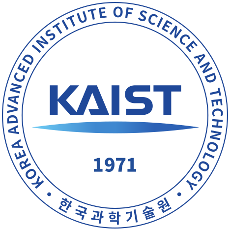

  

    
    

      

        I am Ábel, a computer science graduate from RWTH Aachen University.
        My academic interests include AI for music generation, natural language processing, and computational neuroscience.
        Beyond my studies, I am passionate about playing the piano and enjoy transcribing recordings from my favorite musicians,
        Brad Mehldau and Chick Corea.
      

    

  

  

    <!-- LEFT SIDEBAR -->
    

      <h3>Contact &amp; Personal Info</h3>
      <ul>
        <li>Born: 26 September 1999</li>
        <li>📞 00491726448760</li>
        <li>✉️ ikunabel@gmail.com</li>
        <li>🇩🇪 Aachen, Germany</li>
      </ul>

      <h3>Languages</h3>
      <ul>
        <li><strong>German</strong> (native)</li>
        <li><strong>Hungarian</strong> (native)</li>
        <li><strong>English</strong> (advanced)</li>
        <li><strong>French</strong> (intermediate)</li>
        <li><strong>Romanian</strong> (elementary)</li>
      </ul>

      <h3>Societies</h3>
      <ul>
        <li>Member of 창작동화 Jazz Band (2024–)</li>
        <li>Rowing Club Bad Ems (2016–2019)</li>
      </ul>

      <h3>Interests</h3>
      <ul>
        <li>Computer Music</li>
        <li>Natural Language Processing</li>
        <li>Jazz Piano</li>
        <li>Video and Music Editing</li>
        <li>Running, Table Tennis, Football</li>
        <li>Psychology</li>
      </ul>
    

    <!-- MAIN CONTENT -->
    

      <h1>Research and Projects</h1>

      <h3>🎹 Generating MIDI Piano Performance with Transformers</h3>  
      
<em>Summer 2025</em>

      

        As part of a university lab project under the Computer Vision Chair, I am currently working on generating MIDI piano performances conditioned on MIDI input. We use REMI tokenization and train <strong>Mistral</strong> models on the MAESTRO dataset. Our focus now lies in benchmarking our results against a recent <strong>Llama</strong>-based model with a custom embedding function and attention block called <strong>Moonbeam</strong>. The project involves hands-on experimentation with model architectures, tokenizers, embedding functions and evaluation metrics.
      

      

      <h3>🐍 Mamba State-space Model</h3>  
      
<em>Summer 2024</em>

      

        Over the past summer at my home university, I participated in a research seminar at the Machine Learning and Reasoning chair involving <strong>Mamba</strong>, a recent state-space model. The experience sparked my interest in continuing to explore state-space models on music data! Since Mamba-variants can process extremely long sequences more efficiently than Transformers, it can be interesting to see how they handle long temporal dependencies in music data.
      

      

      <h3>🎵 Computer-generated Music</h3>
      

        During my bachelor degree at RWTH Aachen University, I did a seminar on computer-generated music, where I covered recent neural-network-based approaches like Google Magenta or the Bachbot, also discussing the <strong>LZ</strong> compression algorithm within the OpenMusic software.
      

      

      <h3>🧠 Thesis at Institute for Computational and Systems Neuroscience</h3>
      
<em>October 2022 – May 2023</em>

      

        Bachelor’s thesis on hyper-parameter optimization: The goal here was to optimize the hyper-parameters of a spiking neural network simulator with  <strong>Optuna</strong>. The work involved parallel computation on the <strong>JURECA</strong> cluster and experimentation with sampling algorithms (TPE, random).
      

      

      <h3>🚙 Practical at Cyber-Physical Mobility Lab</h3>  
      
<em>October 2021 – February 2022</em>

      

        Implemented trajectory planning and collision avoidance for model vehicles. Scrum-based workflow in a team of six using Git.
      

      <h1>Work Experience</h1>

      <h3>Tutor at Research Group for Programming Languages and Verification</h3>  
      
<em>October 2021 – March 2022, October 2022 – March 2023</em>

      

        Taught weekly classes (~15 students), graded coding assignments and exams. Topics: Java, Haskell, Prolog, Verification.
      

      

      <h3>Internship at BWI GmbH</h3>
      
<em>March 2020</em>

      

        Intro to Scrum-based project management. Observed live JIRA workflows.
      

      <h1>Education</h1>

      

        
      
 

      
<strong>KAIST</strong> MSc Computer Science Exchange, AI Track 
      <em>September 2024 – December 2024</em> 
      Received DUO-Korea Scholarship

      

      

        
      
 

      
<strong>RWTH Aachen University</strong> MSc Computer Science, AI Track 
      <em>October 2023 – Present</em>

      

      

        
      

      
<strong>RWTH Aachen University</strong> BSc Computer Science 
      <em>October 2019 – June 2023</em> 
      - Thesis at Forschungszentrum Jülich on hyperparameter optimization 
      - Projects on neuro-inspired computing, microcontroller programming, and model vehicle control

      

      
<strong>Goethe Gymnasium Bad Ems</strong> A levels (Abitur) 
      - GPA: 1.6 
      - Majors: English, Mathematics, Physics 
      - DPG Abitur Prize in Physics

      <h1>Programming Stack</h1>

      
<strong>Languages &amp; Tools</strong> 
      Python, C++, Java, C#, SQL, Bash, Git, Linux, Slurm

      
<strong>Machine Learning &amp; Deep Learning</strong> 
      PyTorch, NumPy, Pandas, Matplotlib, Optuna, Jupyter

    

  

