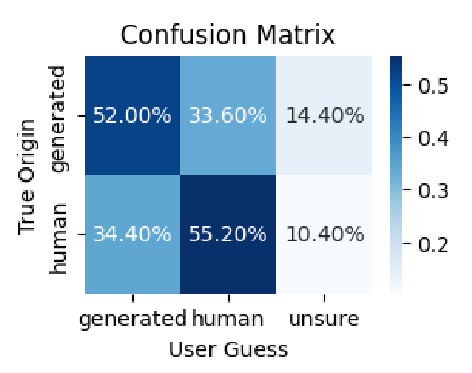
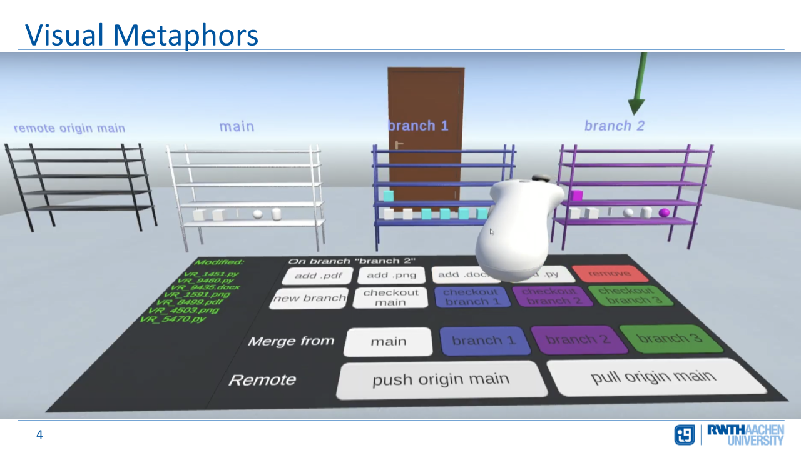

  

    
    

      

        I am Ábel, a computer science graduate from RWTH Aachen University.
        My academic interests include AI for music generation, natural language processing, and computational neuroscience.
        Beyond my studies, I am passionate about playing the piano and enjoy transcribing recordings from my favorite musicians,
        Brad Mehldau and Chick Corea.
          
        <a href="mailto:ikunabel@gmail.com">Email</a> |
        <a href="https://github.com/ikunabel" target="_blank">GitHub</a> |
        <a href="https://www.linkedin.com/in/%C3%A1bel-ily%C3%A9s-kun-6350a3245/" target="_blank">LinkedIn</a> |
        <a href="#" target="_blank">CV</a> <!-- placeholder link -->
      
  
    

  

  

      <h1>Research and Projects</h1>

      <h3>🎹 Generating MIDI Piano Performance with Transformers</h3>  
      
<em>Summer 2025</em>

      

        
      

      

        <strong>Our paper was accepted at the NeurIPS 2025 Workshop on AI for Music: Where Creativity Meets Computation!</strong>
        As part of a university lab project, I worked on generating MIDI piano performances with Transformers. We systematically compared different datasets, model architectures, model sizes, and training strategies to evaluate their impact on generative quality. To support model development and evaluation, we examined a range of quantitative metrics and analyzed how well they correlate with human judgment collected through listening studies. Our best-performing model, a 950M-parameter transformer trained on 80K MIDI files from diverse genres, produces outputs that are often rated as human-composed in a Turing-style listening survey.
      

      

      <h3>VR Game for Learning Git</h3>  
      
<em>Summer 2025</em>

      

        
      

      

        Co-developed a 3D VR game in Unity to teach git in an interactive, hands-on environment. Branches are represented as color-coded shelves, and files as items that can be put on the shelves (e.g., cubes for .py, books for .docx), allowing students to visualize and experiment with core git commands like add, commit, merge, and push. The user can trigger git commands from a UI panel with the VR controller and observe the effect in the immersive environment. The game provides a risk-free space to build mental models, reinforce correct workflows, and reduce fear of mistakes, preparing learners for real-world git projects.
      

      

      <h3>🐍 Mamba State-space Model</h3>  
      
<em>Summer 2024</em>

      

        Over the past summer at my home university, I participated in a research seminar at the Machine Learning and Reasoning chair involving <strong>Mamba</strong>, a recent state-space model. The experience sparked my interest in continuing to explore state-space models on music data! Since Mamba-variants can process extremely long sequences more efficiently than Transformers, it can be interesting to see how they handle long temporal dependencies in music data.
      

      

      <h3>🧠 Thesis at Institute for Computational and Systems Neuroscience</h3>
      
<em>October 2022 – May 2023</em>

      

        Bachelor’s thesis on hyper-parameter optimization: The goal here was to optimize the hyper-parameters of a spiking neural network simulator with  <strong>Optuna</strong>. The work involved parallel computation on the <strong>JURECA</strong> cluster and experimentation with sampling algorithms (TPE, random).
      

      

      <h3>🚙 Practical at Cyber-Physical Mobility Lab</h3>  
      
<em>October 2021 – February 2022</em>

      

        Implemented trajectory planning and collision avoidance for model vehicles. Scrum-based workflow in a team of six using Git.
      

      

      <h3>🎵 Computer-generated Music</h3>
      
<em>Summer 2020</em>

      

        During my bachelor degree at RWTH Aachen University, I did a seminar on computer-generated music, where I covered recent neural-network-based approaches like Google Magenta or the Bachbot, also discussing the <strong>LZ</strong> compression algorithm within the OpenMusic software.
      

        

      <h1>Work Experience</h1>

      <h3>Tutor at Research Group for Programming Languages and Verification</h3>  
      
<em>October 2021 – March 2022, October 2022 – March 2023</em>

      

        Taught weekly classes (~15 students), graded coding assignments and exams. Topics: Java, Haskell, Prolog, Verification.
      

      

      <h3>Internship at BWI GmbH</h3>
      
<em>March 2020</em>

      

        Intro to Scrum-based project management. Observed live JIRA workflows.
      

        

      <h1>Education</h1>

      

        
      
 

      
<strong>KAIST</strong> MSc Computer Science Exchange, AI Track 
      <em>September 2024 – December 2024</em> 
      Received DUO-Korea Scholarship

      

      

        
      
 

      
<strong>RWTH Aachen University</strong> MSc Computer Science, AI Track 
      <em>October 2023 – Present</em>

      

      

        
      

      
<strong>RWTH Aachen University</strong> BSc Computer Science 
      <em>October 2019 – June 2023</em> 
      - Thesis at Forschungszentrum Jülich on hyperparameter optimization 
      - Projects on neuro-inspired computing, microcontroller programming, and model vehicle control

      

      
<strong>Goethe Gymnasium Bad Ems</strong> A levels (Abitur) 
      - Majors: English, Mathematics, Physics 
      - DPG Abitur Prize in Physics

        

      <h1>Programming Stack</h1>

      
<strong>Languages &amp; Tools</strong> 
      Python, C++, Java, C#, SQL, Bash, Git, Linux, Slurm

      
<strong>Machine Learning &amp; Deep Learning</strong> 
      PyTorch, NumPy, Pandas, Matplotlib, Optuna, Jupyter

        

      <h1>Societies</h1>
      <ul>
        <li>Member of 창작동화 Jazz Band (2024–)</li>
        <li>Rowing Club Bad Ems (2016–2019)</li>
      </ul>

        

      <h1>Interests</h1>
      <ul>
        <li>Music Information Retrieval</li>
        <li>Natural Language Processing</li>
        <li>Jazz Piano</li>
        <li>Video and Music Editing</li>
        <li>Running, Table Tennis, Football</li>
        <li>Psychology</li>
      </ul>

  

